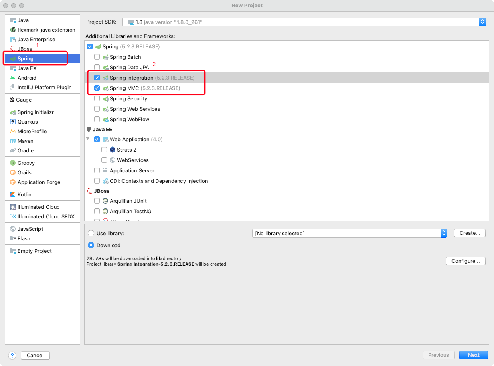
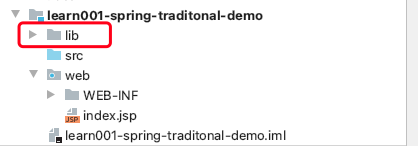
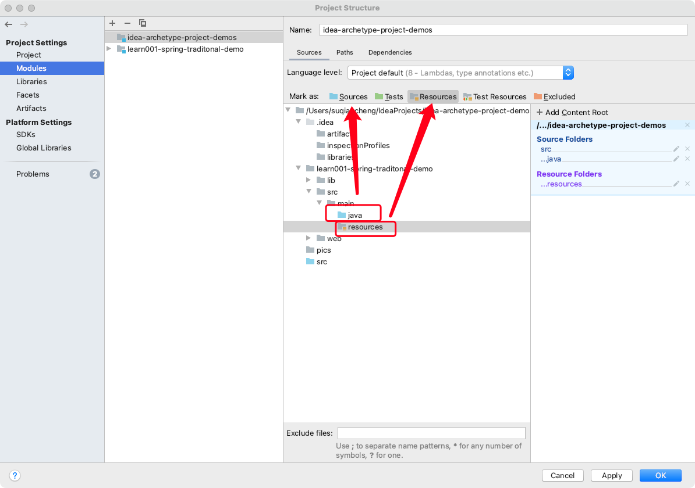
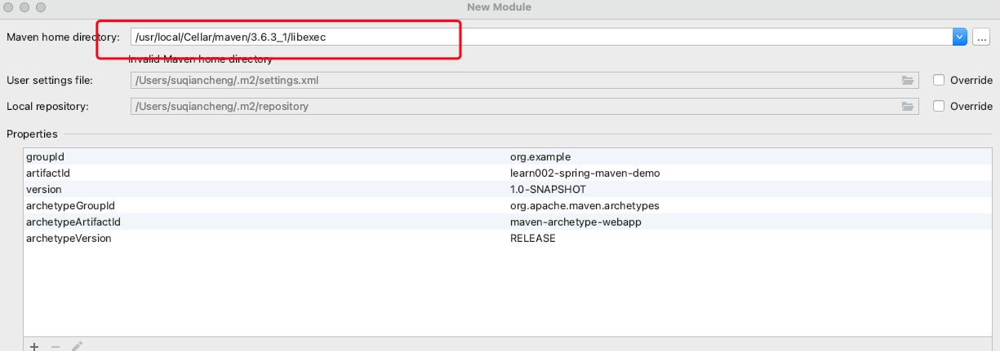
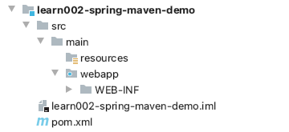
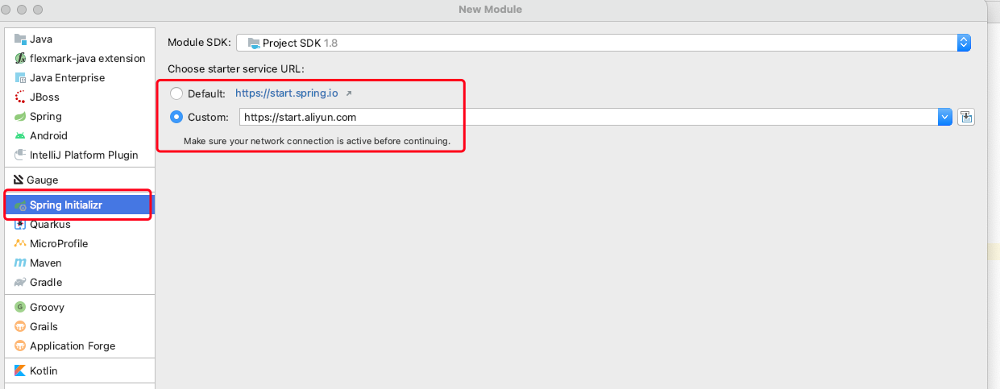
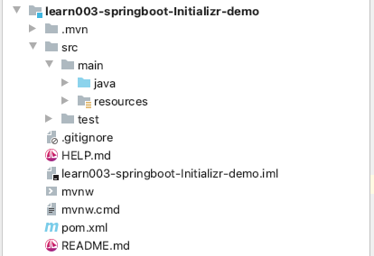

# 使用idea来创建项目的三种方式

 基于Idea创建各种项目的初始化工程，旨在学习和整理idea使用方法。

 在日常的开发过程中，我们需要根据框架需求，创建不同的项目。比如，Spring项目，SpringBoot项目。
 在传统创建项目的过程中，采用的是手动添加项目所依赖的包。
 这种情况下，需要在项目中新建lib目录，并将相关的依赖放到该目录下，此种方式维护项目比较繁琐。
 于是，后来出现了自动化构建工具，可以帮应用程序实现依赖的管理，只需要在配置文件中添加依赖的名称和相关的版本号，即可实现依赖的自动下载。  
 对于这类自动化构建工具中，常见的有maven,gradle等。

 本工程主要介绍基于maven来展开。

## 使用传统方式来创建 Spring项目


 ### IDEA 新建传统的 Spring 项目

File ----> New ----> Project -----> spring ----> 两个地方打勾，



 Next ----> 填 Project Name -----> 选 Project Location -----> Finish.

上图中选择的框架，idea会在初始化项目时，自动进行下载。下载完成之后，项目的目录结构如下图所示：



如上图：

- lib为此项目所依赖的jar包
- src为项目的源码目录，可以在此目录下，依次创建src/main
  - java
    - controller
    - service
  - resources
  等目录结构，并通过project setting 依次将 java 目录设置为sources类型目录，resouces设置为Resources目录。

  


- web为MVC框架中的视图层，可以将前端相关代码及资源文件放置在该目录下。

至此，便完成了使用传统方式来创建Spring 项目。


## 基于maven来创建 Spring项目

在采用该方式来创建Spring项目时，主要应用了maven提供的脚手架(模板)，通过直接选择这些模板，可以快速的创建一个Spring项目。

基本步骤如下：

1.新建Maven项目，勾选Create from archetype,选择webapp


上图中展示了不少的基于maven创建项目的模板。本次采用了webapp这个模板

这是一个一个最简单的Maven war项目模板，当需要快速创建一个Web应用的时候可以使用它。

关于maven的更多的脚手架介绍，可以参考文章：

- [maven的41种脚手架介绍](https://blog.csdn.net/qq_30757197/article/details/103630048?spm=1001.2014.3001.5502)

2. Next ----> 填 Project Name -----> 选 Project Location -----> Finish.

3.配置Maven，可以选择使用IDEA内置的Maven，也可以使用的是本地安装的Maven，然后下一步到完成。



4. 项目创建后，maven会构建项目，项目结构目录如下：



如上图所示，该模板会将所有的依赖在pom文件中来配置，而替代了传统方法中的lib目录。

打开pom文件，添加spring-web框架的依赖到该项目中，即可实现对Spring框架的应用

```
   <!--spring所需依赖-->
    <dependency>
      <groupId>org.springframework</groupId>
      <artifactId>spring-web</artifactId>
      <version>4.3.8.RELEASE</version>
    </dependency>
    <dependency>
      <groupId>org.springframework</groupId>
      <artifactId>spring-webmvc</artifactId>
      <version>4.3.8.RELEASE</version>
    </dependency>
 
    <!--其他需要的包-->
    <dependency>
      <groupId>org.apache.commons</groupId>
      <artifactId>commons-lang3</artifactId>
      <version>3.4</version>
    </dependency>
```

Java代码，可以在main目录下，新建java目录来实现程序的书写及相关项目的配置。


## 基于maven 来创建 SpringBoot项目


创建Springboot项目，可以采用SpringInitianlizer的方式来创建，原理类似maven脚手架，利用模板来生成。

其基本步骤如下：



在这里，默认的模板来自https://start.spring.io ，也可以选择阿里云提供的模板https://start.aliyun.com .

 Next ----> 填 Project Name -----> 选 Project Location ----->选择项目中需要的依赖---> Finish.

得到的目录结构如下：



